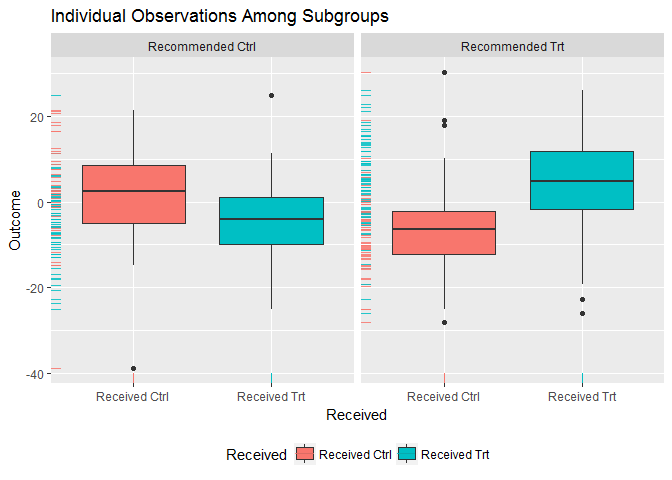

[](https://travis-ci.org/jaredhuling/personalized)


## Introduction to the 'personalized' package

The personalized package provides estimation methods for subgroup identification under the framework of [Chen et al (2017)](http://onlinelibrary.wiley.com/doi/10.1111/biom.12676/abstract)

Install using the **devtools** package:


```r
devtools::install_github("jaredhuling/personalized")
```

or by cloning and building using `R CMD INSTALL`

## Quick Usage Reference

Load the package and access help files for the main functions:

```r
library(personalized)
```


```r
?fit.subgroup
?validate.subgroup
```


```r
set.seed(123)
n.obs  <- 250
n.vars <- 1000
x <- matrix(rnorm(n.obs * n.vars, sd = 3), n.obs, n.vars)


# simulate non-randomized treatment
xbetat   <- 0.5 + 0.5 * x[,21] - 0.5 * x[,41] + 0.5 * x[,1] * x[,12]
trt.prob <- exp(xbetat) / (1 + exp(xbetat))
trt01    <- rbinom(n.obs, 1, prob = trt.prob)

trt      <- 2 * trt01 - 1

# simulate response
delta <- (0.5 + x[,2] - x[,3] - x[,11])
xbeta <- x[,1] + x[,11] - 0.5 * x[,12]^2 + x[,13] + 0.5 * x[,15] ^ 2
xbeta <- xbeta + delta * trt

# continuous outcomes
y <- drop(xbeta) + rnorm(n.obs, sd = 2)

# create function for fitting propensity score model
prop.func <- function(x, trt)
{
    # fit propensity score model
    propens.model <- cv.glmnet(y = trt,
                               x = x, family = "binomial")
    
    # return predicted Pr(trt = 1 | X = x)
    pi.x <- predict(propens.model, s = "lambda.min",
                    newx = x, type = "response")[,1]
    pi.x
}

subgrp.model <- fit.subgroup(x = x, y = y,
                             trt = trt01,
                             propensity.func = prop.func,
                             method = "a_learning",
                             loss   = "sq_loss_lasso",
                             nfolds = 10)              # option for cv.glmnet

summary(subgrp.model)
```

```
## family:  gaussian 
## loss:    sq_loss_lasso 
## method:  a_learning 
## 
## Average Outcomes:
##                Recommended Trt Recommended Ctrl
## Received Trt   5.2193 (n = 73) -5.9879 (n = 69)
## Received Ctrl -6.8308 (n = 70)  5.7565 (n = 38)
## 
##  Trt  Effect Among Recommended Trt Ctrl Effect Among Recommended Ctrl 
##                  12.0501 (n = 143)                  11.7444 (n = 107) 
## 
## Benefit score quantiles: 
##      0%     25%     50%     75%    100% 
## -20.187  -5.491   1.821   7.587  21.276 
## 
## 24 variables selected by the lasso (cross validation criterion).
## 
##          Estimate
## V2    1.176672910
## V3   -1.677310716
## V6    0.557432561
## V11  -1.295443491
## V24   0.172071675
## V145 -0.161864923
## V197  0.129665339
## V298  0.159134624
## V336  0.038150991
## V349 -0.005098594
## V431 -0.148129193
## V508 -0.003919389
## V512 -0.172885742
## V540  0.115712326
## V555 -0.110480828
## V600 -0.492156891
## V603 -0.144105401
## V644  0.148491828
## V707 -0.459510002
## V768  0.136137419
## V828  0.806748213
## V950  0.071287675
## V953 -0.180628947
## V971 -0.003399006
```


```r
plot(subgrp.model)
```

<!-- -->


