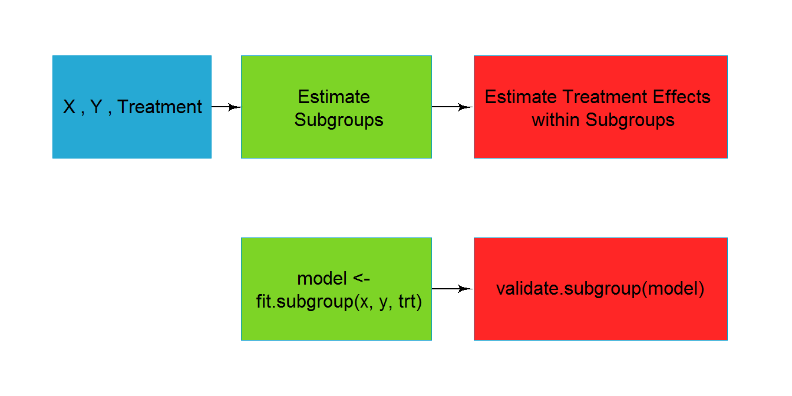
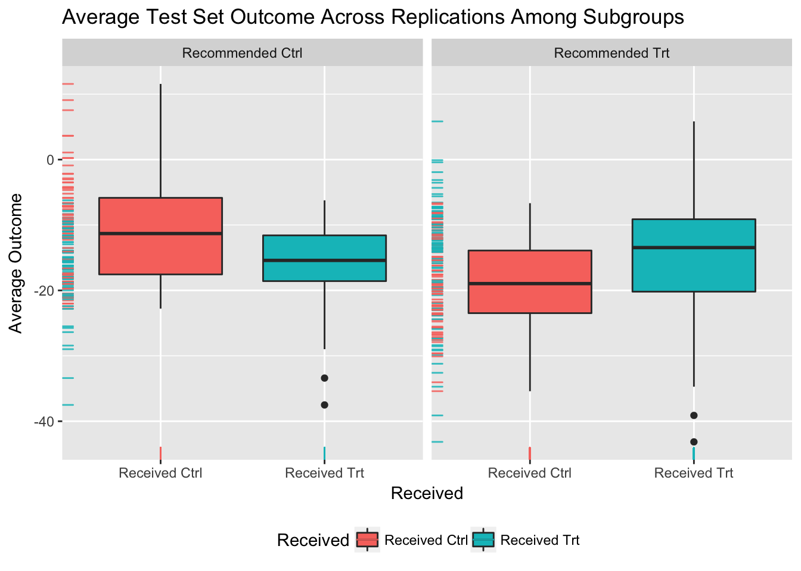

[](https://cran.r-project.org/package=personalized)
[](https://travis-ci.org/jaredhuling/personalized)
[](https://ci.appveyor.com/project/jaredhuling/personalized)
[](https://codecov.io/gh/jaredhuling/personalized)
[](https://cran.r-project.org/package=personalized)


# Overview of ‘personalized’

The ‘personalized’ package is designed for the analysis of data where
the effect of a treatment or intervention may vary for different
patients. It can be used for either data from randomized controlled
trials or observational studies and is not limited specifically to the
analysis of medical data.

The personalized package provides estimation methods for subgroup
identification under the framework of [Chen et al
(2017)](http://onlinelibrary.wiley.com/doi/10.1111/biom.12676/abstract).
It also provides routines for valid estimation of the subgroup-specific
treatment effects.



## Documentation

[Documentation](http://jaredhuling.org/personalized/)

  - [Tutorial /
    Vignette](http://jaredhuling.org/personalized/articles/usage_of_the_personalized_package.html)
    - tutorial of statistical methodology and usage of the package

  - [Function help
    files](http://jaredhuling.org/personalized/reference/index.html)

# Installing the ‘personalized’ package

Install from CRAN using:

``` r
install.packages("personalized")
```

or install the development version using the **devtools** package:

``` r
devtools::install_github("jaredhuling/personalized")
```

or by cloning and building using `R CMD INSTALL`

# Quick Usage Overview

Load the package:

``` r
library(personalized)
```

### Create a propensity score model

(it should be a function which inputs covariates and treatments and
returns propensity score):

``` r
prop.func <- function(x, trt)
{
    # fit propensity score model
    propens.model <- cv.glmnet(y = trt,
                               x = x, family = "binomial")
    pi.x <- predict(propens.model, s = "lambda.min",
                    newx = x, type = "response")[,1]
    pi.x
}
```

### Fit a model to estimate subgroup:

``` r
subgrp.model <- fit.subgroup(x = x, y = y,
                             trt = trt,
                             propensity.func = prop.func,
                             loss   = "sq_loss_lasso",
                             nfolds = 5)              # option for cv.glmnet
```

### Display estimated subgroups and variables selected which determine the subgroups:

``` r
summary(subgrp.model)
```

    ## family:    gaussian 
    ## loss:      sq_loss_lasso 
    ## method:    weighting 
    ## cutpoint:  0 
    ## propensity 
    ## function:  propensity.func 
    ## 
    ## benefit score: f(x), 
    ## Trt recom = Trt*I(f(x)>c)+Ctrl*I(f(x)<=c) where c is 'cutpoint'
    ## 
    ## Average Outcomes:
    ##                Recommended Ctrl    Recommended Trt
    ## Received Ctrl -3.9319 (n = 109) -21.2055 (n = 122)
    ## Received Trt  -25.078 (n = 112)   -8.326 (n = 157)
    ## 
    ## Treatment effects conditional on subgroups:
    ## Est of E[Y|T=Ctrl,Recom=Ctrl]-E[Y|T=/=Ctrl,Recom=Ctrl] 
    ##                                      21.1461 (n = 221) 
    ##     Est of E[Y|T=Trt,Recom=Trt]-E[Y|T=/=Trt,Recom=Trt] 
    ##                                      12.8795 (n = 279) 
    ## 
    ## NOTE: The above average outcomes are biased estimates of
    ##       the expected outcomes conditional on subgroups. 
    ##       Use 'validate.subgroup()' to obtain unbiased estimates.
    ## 
    ## ---------------------------------------------------
    ## 
    ## Benefit score quantiles (f(X) for Trt vs Ctrl): 
    ##      0%     25%     50%     75%    100% 
    ## -9.2792 -1.8237  0.5011  2.5977  9.6376 
    ## 
    ## ---------------------------------------------------
    ## 
    ## Summary of individual treatment effects: 
    ## E[Y|T=Trt, X] - E[Y|T=Ctrl, X]
    ## 
    ##     Min.  1st Qu.   Median     Mean  3rd Qu.     Max. 
    ## -18.5583  -3.6474   1.0023   0.9507   5.1954  19.2753 
    ## 
    ## ---------------------------------------------------
    ## 
    ## 5 out of 50 interactions selected in total by the lasso (cross validation criterion).
    ## 
    ## The first estimate is the treatment main effect, which is always selected. 
    ## Any other variables selected represent treatment-covariate interactions.
    ## 
    ##             Trt     V2     V11     V17    V32    V35
    ## Estimate 0.5463 0.9827 -0.4356 -0.1532 0.0326 0.1007

### Use repeated train and test splitting to estimate subgroup treatment effects:

``` r
val.model <- validate.subgroup(subgrp.model, B = 100,
                               method = "training_test",
                               train.fraction = 0.75)
```

### Display estimated subgroup treatment effects:

``` r
print(val.model, digits = 2, sample.pct = TRUE)
```

    ## family:  gaussian 
    ## loss:    sq_loss_lasso 
    ## method:  weighting 
    ## 
    ## validation method:  training_test_replication 
    ## cutpoint:           0 
    ## replications:       100 
    ## 
    ## benefit score: f(x), 
    ## Trt recom = Trt*I(f(x)>c)+Ctrl*I(f(x)<=c) where c is 'cutpoint'
    ## 
    ## Average Test Set Outcomes:
    ##                         Recommended Ctrl           Recommended Trt
    ## Received Ctrl  -9.56 (SE = 7.98, 19.88%) -18.62 (SE = 6.72, 26.5%)
    ## Received Trt  -16.64 (SE = 6.85, 23.23%) -13.41 (SE = 7.8, 30.39%)
    ## 
    ## Treatment effects conditional on subgroups:
    ## Est of E[Y|T=Ctrl,Recom=Ctrl]-E[Y|T=/=Ctrl,Recom=Ctrl] 
    ##                              6.54 (SE = 10.49, 43.11%) 
    ##     Est of E[Y|T=Trt,Recom=Trt]-E[Y|T=/=Trt,Recom=Trt] 
    ##                              5.21 (SE = 11.06, 56.89%) 
    ## 
    ## Est of 
    ## E[Y|Trt received = Trt recom] - E[Y|Trt received =/= Trt recom]:                 
    ## 2.91 (SE = 8.29)

Visualize subgroup-specific treatment effect estimates across
training/testing
iterations:

``` r
plot(val.model)
```



### Investigate the marginal characteristics of the two estimated subgroups

Here we only display covariates with a significantly different mean
value (at level 0.05)

``` r
summ <- summarize.subgroups(subgrp.model)
print(summ, p.value = 0.05)
```

    ##     Avg (recom Ctrl) Avg (recom Trt) Ctrl - Trt SE (recom Ctrl)
    ## V2           -2.4161          1.9013     -4.317          0.1423
    ## V11           1.1279         -0.7963      1.924          0.1914
    ## V17           0.8053         -0.3715      1.177          0.2170
    ##     SE (recom Trt)
    ## V2          0.1298
    ## V11         0.1572
    ## V17         0.1736

## Accessing Help Files for Main Functions of `personalized`

Access help files for the main functions of the `personalized` package:

``` r
?fit.subgroup
?validate.subgroup
```
